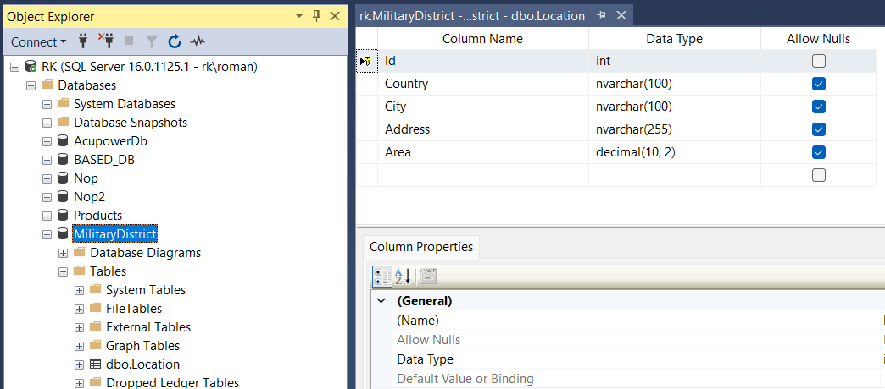
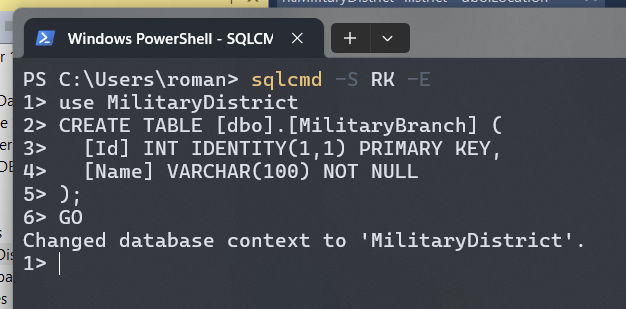

# Lab 2

Variant 3

DB: MilitaryDistrict

## Subtask

Task for additional point is in `subtask` directory. It contains of sql scripts to create 2 tables and fill them with some values:

| Product |
| ------- |
| Id      |
| Name    |
| Price   |

| Brand   |
| ------- |
| Name    |
| Country |
