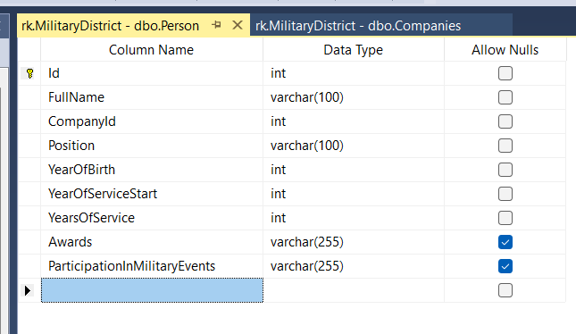
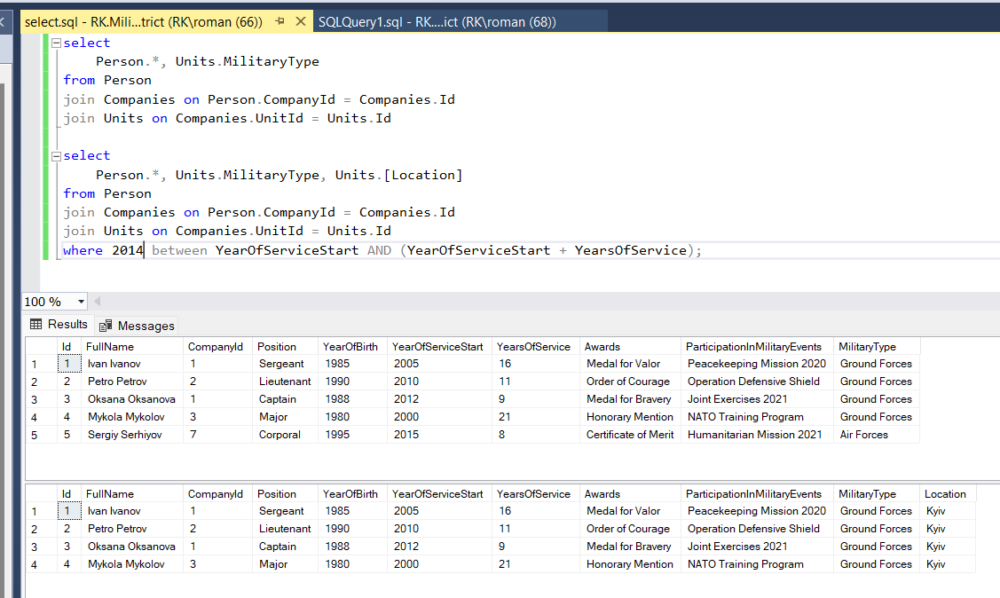

# Lab 5

1. Створити таблицю особового складу військовослужбовців, яка має такі атрибути:

- ПІБ
- рота
- посада
- рік народження
- рік надходження на службу
- вислуга (кількість років)
- нагороди
- участь у військових заходах

Зв’язати з іншими таблицями. Додати в неї 5 записів.

2. Вивести весь особовий склад з назвою частини, роти, виду військ.

3. Вивести інформацію про військовослужбовців, і про їх дислокацію певної частини на певну дату.

